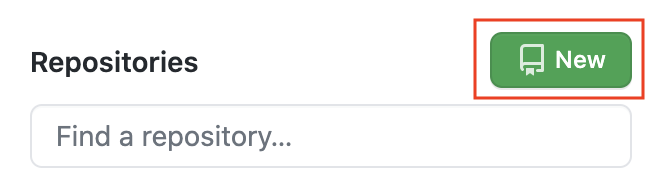
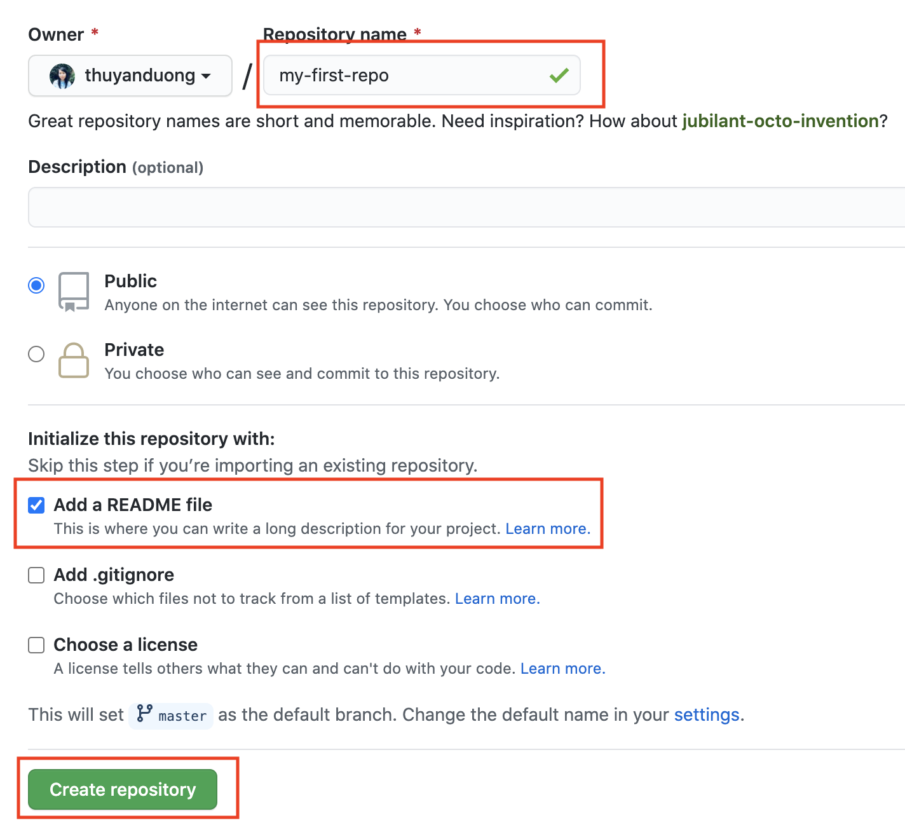
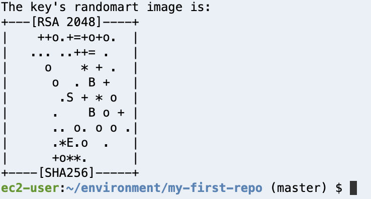
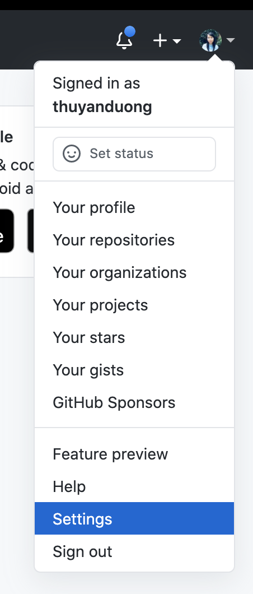
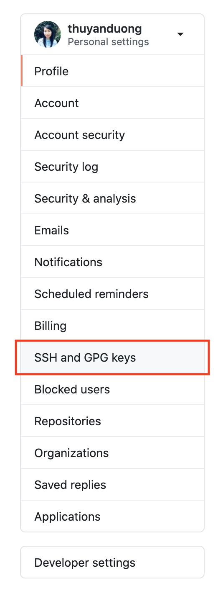
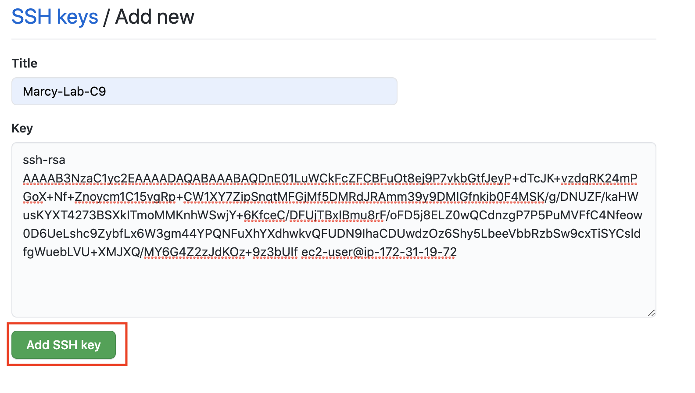
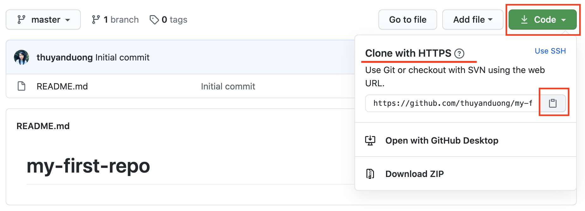

# Configure Your Github Account in AWS Cloud9

You will be using Github individually and collaboratively. We will set up your Cloud9
EC2 to be able to communicate with your Github account. You'll be able to copy code from a
remote source (Github) and make changes to it on your personal virtual machine (Cloud9).

## Objectives
FWBAT...
1. Clone Github repositories through their Cloud 9 Environment.
2. Clone via HTTP and SSH.
3. Push to and pull from a Github repository.

### Create a Github Account

[Create a Github Account](https://github.com/join). If you already have one, you can skip to the next step.

### Configure Github in the AWS Terminal

1. Open up your Cloud9 environment. Run the following lines in the terminal:

```sh
git config --global user.name "Your Name"
git config --global user.email "Your Github Email Address"
git config --global credential.helper store
```

2. Confirm that the configuration was successful by running `git config --global user.name`. The terminal should print out your name. Next, run `git config --global user.email`. The terminal should print our your email address.

### Create a Repository on Github

1. Navigate to Github in the browser and log in. ON the left, click the button to create a new repository.



2. Name your repository `my-first-repo`. Choose to add a README.md file. Create the repository.



### Add SSH Key

While we're configuring GitHub, we should add a new SSH key. 

1. First, check if you already have an SSH key by running `cat ~/.ssh/id_rsa.pub`. If the terminal prints out a long string of characters starting with ssh-rsa, you've already got a key.

2. If the running previous step printed "No such file or directory", then run `ssh-keygen` to create a key. Leave everything blank and press enter for the default location and no passphrase. You should be prompted to select a file and passphrase for your new key. Leave everything blank and press enter for the default location and no passphrase. If you’re asked if you want to overwrite, then you already have an SSH key, and you do not want to overwrite it. If you've done every correctly, you should be something like this printed to your terminal:



Run `cat ~/.ssh/id_rsa.pub` in your terminal. Copy the output (starting from `ssh-rsa`). You'll need it for the next step

3. Navigate to the homepage of Github in your browser. Go to your account settings:



Click "SSH and GPG Keys":



Click the "New SSH key" button:


Put whatever you want for the title, but preferably something related to C9 since that's the machine that has this key. Paste the key in the text area and click "Add SSH key".



### Clone Using SSH

1. Click on the Code button and make sure the pop-up has "SSH" underlined and selected. The url should start with `git@github.com:...`. If this is not the case, click the link that say `SSH`. Copy that URL in the text box.



2. Back in your Cloud9 terminal, choose a location for your working directory and run `git clone <ssh_url>`, using the URL you copied from the previous step. If asked, "Are you sure you want to continue connecting", type `yes`. Then `cd` into your project. 

3. Once your repo can been cloned down, use the Cloud9 IDE to update the README.md (you can work on the `master` branch). **Add a 3-4 sentence bio about yourself**. Be sure to save the file.

4. Push the changes back up to Github using best practices:
```sh
git status
git add README.md
git commit -m "added bio"
git push
```
5. Go back to viewing your repository in the browser. Refresh the page and confirm that you see you bio!
