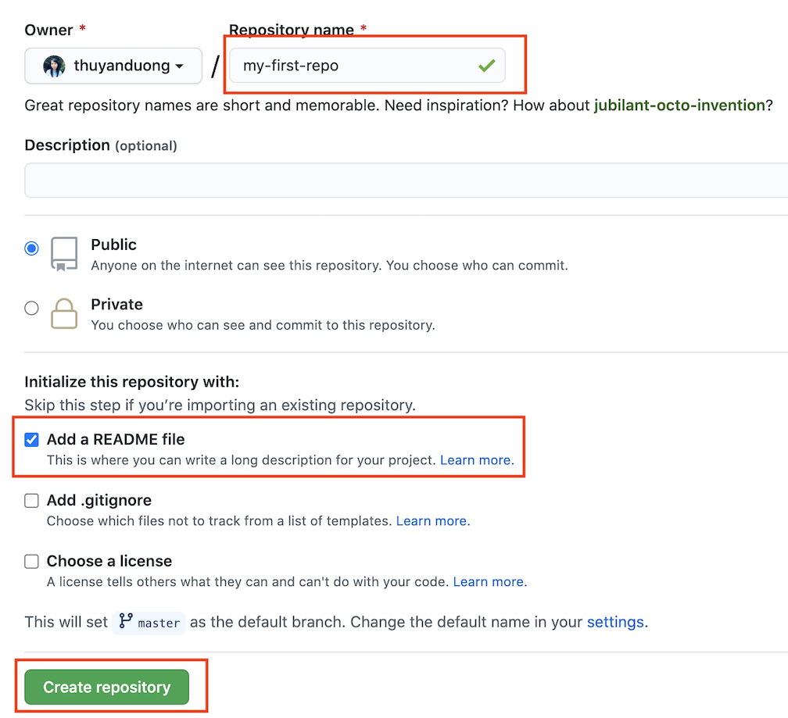
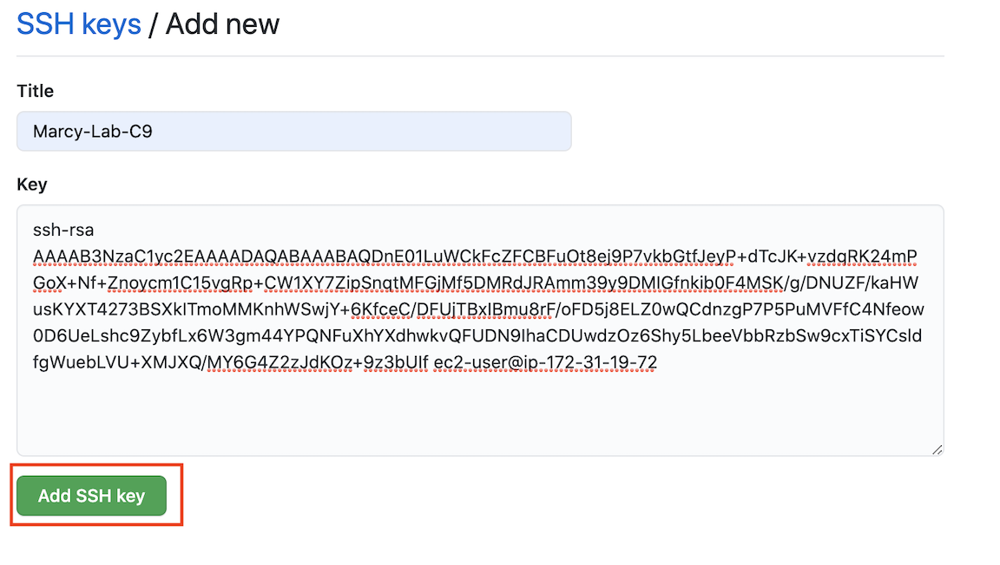
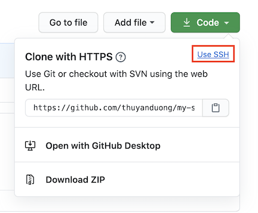

# Configure Your Github Account in AWS Cloud9

You will be using Github individually and collaboratively. We will set up your Cloud9
EC2 to be able to communicate with your Github account. You'll be able to copy code from a
remote source (Github) and make changes to it on your personal virtual machine (Cloud9).

## Objectives
FWBAT...
1. Clone Github repositories through their Cloud 9 Environment.
2. Clone via HTTP and SSH.
3. Push to and pull from a Github repository.

### Create a Github Account

[Create a Github Account](https://github.com/join). If you already have one, you can skip to the next step.

### Configure Github in the AWS Terminal

1. Open up your Cloud9 environment. Run the following lines in the terminal:

```sh
git config --global user.name "Your Name"
git config --global user.email "Your Github Email Address"
git config --global credential.helper store
```

2. Confirm that the configuration was successful by running `git config --global user.name`. The terminal should print out your name. Next, run `git config --global user.email`. The terminal should print our your email address.

### Create a Repository on Github

1. Navigate to Github in the browser and log in. ON the left, click the button to create a new repository.


2. Name your repository `my-first-repo`. Choose to add a README.md file. Create the repository.



### Clone Using HTTPS

1. Click on the Code button and make sure the pop-up says "Clone with HTTPS". The url should start with `https://github.com/...`. If this is not the case, click the link that say `HTTPS`. Copy that URL in the text box.


2. Back in your Cloud9 terminal, choose a location for your working directory and run `git clone <https_url>`, using the URL you copied from the previous step. Then `cd` into that project.

3. Once your repo can been cloned down, use the Cloud9 IDE to update the README.md (you can work on the `master` branch). **Add a 3-4 sentence bio about yourself**. Be sure to save the file.

4. Push the changes back up to Github using best practices:
```sh
git status
git add README.md
git commit -m "added bio"
git push
```
**Note:** You may be prompted to provide your Github username and password. Because you cloned using HTTPS and configured `credential.helper`, you will only need to provide your credentials **once per repository**.

### Add SSH Key

While we're configuring GitHub, we should add a new SSH key. Unlike with HTTPS, setting this key up will keep you from having to provide your username and password whenever you use the terminal to interact with GitHub.

1. First, check if you already have an SSH key by running `cat ~/.ssh/id_rsa.pub`. If the terminal prints out a long string of characters starting with ssh-rsa, you've already got a key.

2. If the running previous step printed "No such file or directory", then run `ssh-keygen` to create a key. Leave everything blank and press enter for the default location and no passphrase. You should be prompted to select a file and passphrase for your new key. Leave everything blank and press enter for the default location and no passphrase. If you’re asked if you want to overwrite, then you already have an SSH key, and you do not want to overwrite it. If you've done every correctly, you should be something like this printed to your terminal:


Run `cat ~/.ssh/id_rsa.pub` in your terminal. Copy the output (starting from `ssh-rsa`). You'll need it for the next step

3. Navigate to the homepage of Github in your browser. Go to your account settings:


Click "SSH and GPG Keys":


Click the "New SSH key" button:


Put whatever you want for the title, but preferably something related to C9 since that's the machine that has this key. Paste the key in the text area and click "Add SSH key".



### Clone Using SSH

Cloning with HTTPS will require your credentials once per cloned repo, but using SSH allows you to bypass this annoying interruption in your work flow.

1. Create another repository just like the one from before, except this time, call it `my-second-repo`. Create it as a public repo and with a README.md.

2. This time, after you click the "Code" button, proceed to click on the "Use SSH" link. This will change the URL in the text box to something like `git@github.com:...`. Copy this URL.



3. Clone the repo using your Cloud9 terminal: `git clone <ssh_url>`. If asked, "Are you sure you want to continue connecting", type `yes`. Then `cd` into your project.

4. Make changes to the `README.md` file, commit, and push those changes back up.

5. Now that your SSH key is set up, you will not have to provide your username and password ever again while you're working in the terminal as long as you always clone using SSH.

**Note:** If you have enabled 2-Factor-Authentication on your Github Account, you should only be cloning using SSH since it interferes with your terminal's ability to login using just your password.
